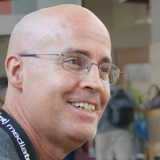

# Adam Culp

## Social Media

* [Twitter](https://www.twitter.com/adamculp) 
* [Github](https://www.github.com/github.com/adamculp)

## Details

* **Company/Organization**: Zend / Rogue Wave Software
* **Job Title/Role**: Senior Professional Services Consultant

## Public Profile

Adam Culp (@AdamCulp) author of Refactoring 101 and consultant at Zend Technologies is passionate about developing with PHP and contributes to many open source projects. He organizes the SunshinePHP Developer Conference and South Florida PHP Users Group (SoFloPHP) where he enjoys helping others write good code, implement standards, refactor efficiently, and incorporate unit and functional testing into their projects. He is a Zend Certified PHP 5.3 Engineer, and holds a seat on the Zend Framework Certification Advisory Board. When he is not coding or contributing to various developer communities, he can be found hiking around the United States National Parks. 

