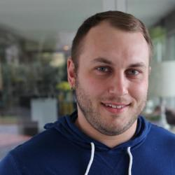

# Adam Wathan

## Social Media

* [Twitter](https://www.twitter.com/adamwathan) 

## Details

* **Company/Organization**: Company
* **Job Title/Role**: Senior Developer

## Public Profile

Adam Wathan is a developer, author, speaker, and active open source contributor. He's worked with startups and enterprise customers alike to help them bring new project ideas to life quickly and reliably using tools like Laravel 5. He’s also the host of the Full Stack Radio podcast and the author of &quot;Refactoring to Collections&quot;. 

