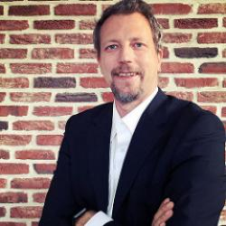

# Michelangelo Van Dam

## Social Media

* [Twitter](https://www.twitter.com/DragonBe) 
* [Github](http://)
* [LinkedIn](http://)
* [Facebook](http://)

## Details

* **Company/Organization**: In2it
* **Job Title/Role**: Zend Certified Engineer

## Public Profile

Michelangelo van Dam works at in2it as a professional PHP consultant assisting businesses to automate their development processes, improve their code quality and train their development teams. Michelangelo is also president of the PHP user group PHPBenelux where he and a team organizes monthly meetups, development events and an annual conference. He's a devoted member of the global PHP community and contributes to open-source projects, mainly PHP related. 

