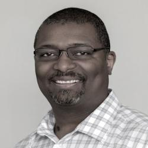

# Robert McFrazier

## Social Media

* [Twitter](https://www.twitter.com/rmcfrazier) 
* [LinkedIn](https://www.linkedin.com/in/robert-mcfrazier-00a3323)

## Details

* **Company/Organization**: Google
* **Job Title/Role**: Solutions Engineer

## Public Profile

Robert McFrazier has been in the software industry in the Seattle area for over 15 years in many different roles including LAMP engineer, software developer, technical trainer, architect, technical support, and manager. He has been on the technical review teams for two Cassandra books: Learning Cassandra for Administrators and Cassandra Data Modeling and Analysis. Robert enjoys learning new things and working on strong teams. He spends his free time with wife and son trying to stay dry in the pacific northwest. 

