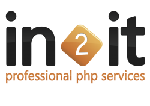

# In2it

* [Website](http://in2.se/pnwphp16) 

At in2it we have a passion for PHP that's part of our DNA. We enjoy helping out clients improving their development workflow, coach and mentor their development teams and provide training on PHP7, unit testing, Zend Framework and automated deployments on distributed architectures.

Besides that are a true open source company where we invest development time and code into PHP projects. We also sponsor many user group meetups and PHP conferences as we believe that knowledge has to be accessible to everyone.

Come find us on http://www.in2it.be  and discover how we can help your business achieving your goals.

## Contact

Michelangelo Van Dam

## Notes

* Copper Sponsor in 2016
